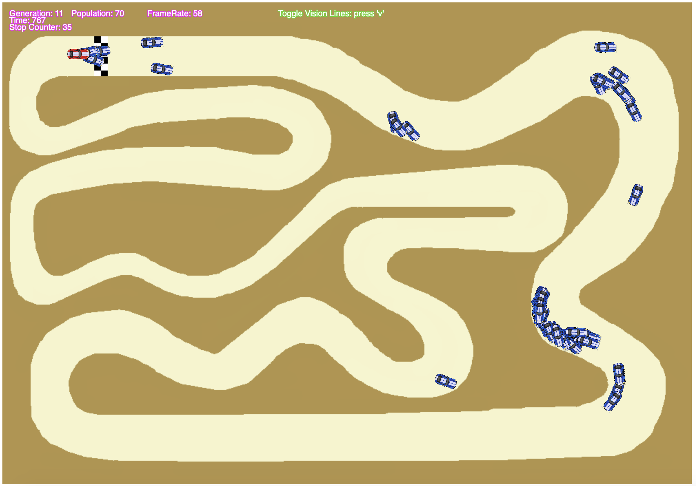

# Smart Cars - Machine Learning Project
In this project a population of cars learn to drive around a track using neural networks trained with a genetic algorithm. 
Each car's neural network uses distances to the track walls and current speed as the inputs. 
Constructed using p5.js libraries so it can be downloaded and run in a browser.

To run this program, simply download the project files and open the index.html file in your browser. It may fail to run initially, producing errors 
in the console relating to image import restrictions. This can be very easily fixed by running the program in a local web server. Here is an example 
of an easy to use web server application: https://greggman.github.io/servez/. Simply download this app, select the project folder for the Smart Cars 
program and hit the 'start' and 'launch browser' buttons.

## Project Overview

The image below shows the structure of the neural network for each car. The distances shown in the diagram on the left are taken as inputs along with the cars 
current speed. There are 6 nodes in the hidden layer and then 4 nodes in the output layer corresponding to the 4 actions a car can take: accelerate, brake, turn 
left and turn right.

This screenshot shows the 1st generation at the start of the program. Each car has a random set of weight values for their neural networks so they will drive 
around randomly if they drive at all.

This screenshot shows the end of the 1st generation run. A few cars actually made it a reasonable distance down the track. There are hidden checkpoints all along 
the track which are used to calculate each cars relative fitness. The cars that made it the furthest will be more likely to be selected by the genetic algorithm 
to be parents for the next generation.

The following screenshots show the progress of the 10th, 11th and 16th generations.

